# CollisionDetectionStudy
碰撞检测实战学习

## 工具

1. Unity版本(2019 4.31f1c1)
2. Visual Studio 2019

## 最终目标

通过深入学习碰撞检测里的数学知识，实战实现一套2D常规形状的碰撞检测系统，为未来技能系统的碰撞判定打下基础。

## 相交检测效果图

AABB与AABB:

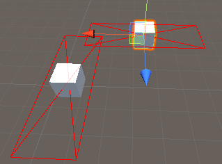

圆与凸多边形:

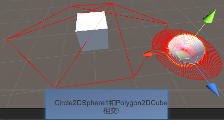

圆与AABB:

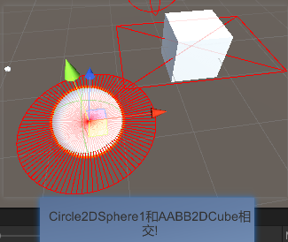

圆与椭圆形:

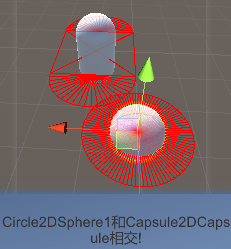

圆与OBB:

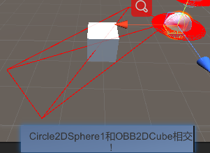

圆与旋转椭圆形:

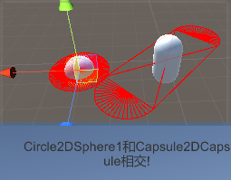

圆与扇形:

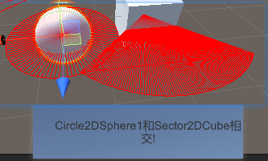

点与凸多边形:

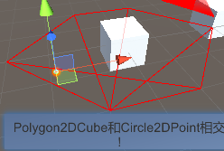

点与凸多边形:

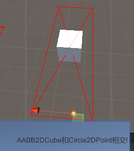

线段相交:

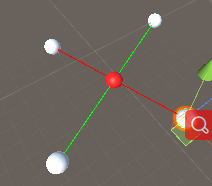

线段(含延长线)相交:

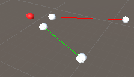

## 重点知识

1. **基础形状都是可以通过数学定义表达出来**
2. [分离轴定理（separating axis theorem, SAT）分离轴定理是指，两个不相交的凸集必然存在一个分离轴，使两个凸集在该轴上的投影是分离的。](https://blog.csdn.net/qq_37043683/article/details/80375691)
3. **叉乘算方向，点乘算角度**
4. **利用叉乘结果y大于0还是y小于0区分方向的同时，我们还能用于推断向量A在向量B的左侧还是右侧(大前提是两个向量在XZ平面)**
5. **在坐标平移旋转转换时注意先旋转后平移，不然先平移后旋转会导致坐标转换错误，因为先旋转后平移!=先平移后旋转**
6. **Unity是左手坐标系，会影响叉乘结果的向量朝向**

## 博客

博客学习记录链接:

[数学知识](http://tonytang1990.github.io/2022/02/21/数学知识/)

[碰撞检测](http://tonytang1990.github.io/2022/01/21/%E7%A2%B0%E6%92%9E%E6%A3%80%E6%B5%8B/#%E5%BD%A2%E7%8A%B6%E7%A2%B0%E6%92%9E%E6%A3%80%E6%B5%8B)